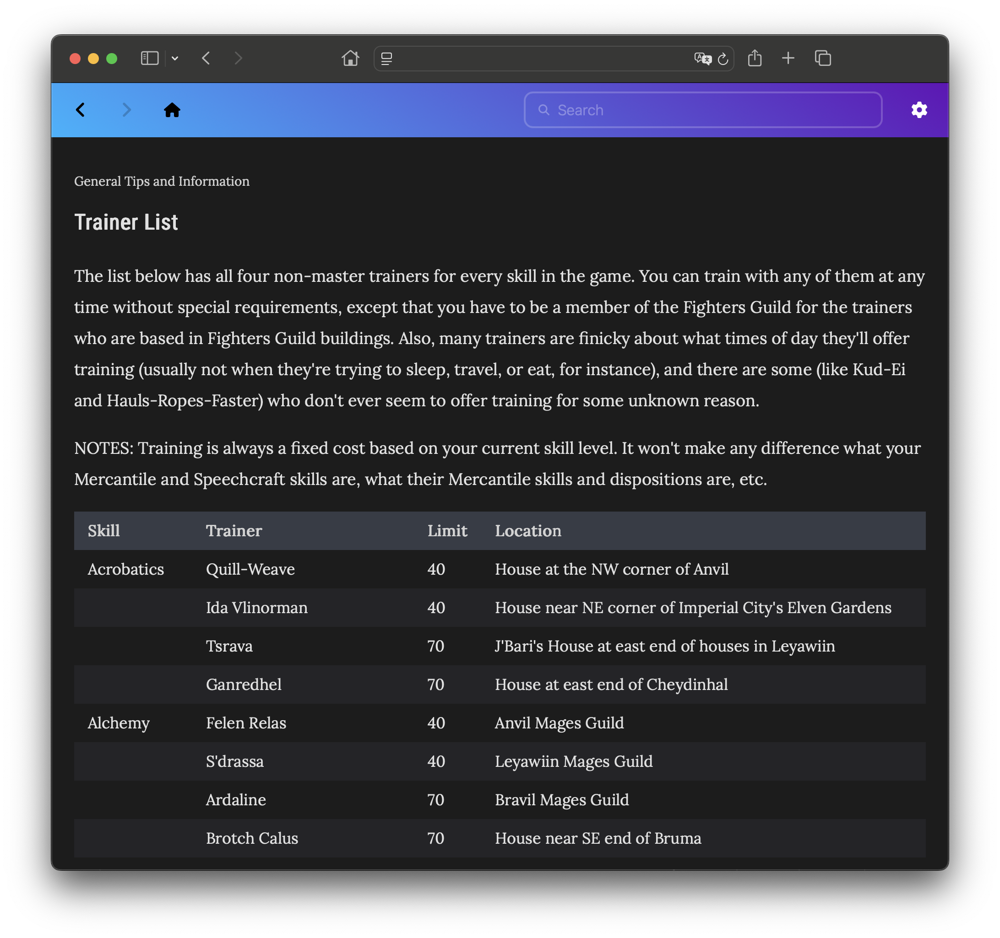
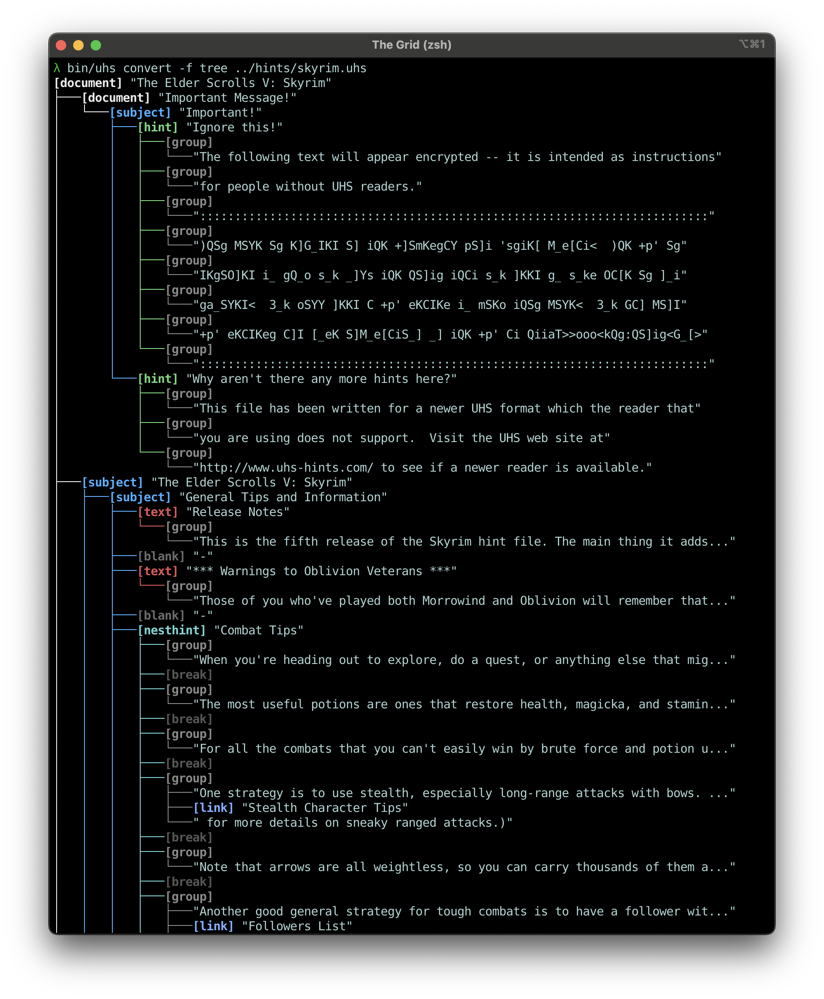

# libuhs

A C++ library for reading, parsing, and writing [Universal Hint System](https://www.uhs-hints.com) (UHS) files, with a TypeScript frontend for interactive HTML viewing.

## Screenshots



## Introduction

No smart phones. Few digital ads. For most people, _no Internet_. Life in the mid-'90s was a different time. But there were still games, and if you were stuck on one, I mean really stuck, you only had a few options.

The one I turned to most often was the Universal Hint System. UHS was perfect for the kinds of adventure and role playing games I've always loved, with questions you could explore by topic and hints that would get increasingly direct. Most of the time I only needed a nudge in the right direction, not major accidental spoilers for some other part of the game I hadn't even seen yet.

UHS was created by Jason Strautman in 1988 (nearly 40 years ago!), and he and Robert Norton collaborated on feature updates over the next several years. It's a file format: `.uhs`. There are nearly 600 games in the library; one game per file, more or less, with the last big one being Skyrim. Computer games are best represented, but there are plenty of multi-platform titles up through the Xbox 360 era. Today these hints are all available on [uhs-hints.com](https://www.uhs-hints.com).

Having spent years, on and off, creating a clean room implementation of this format, it must be said that the format is also clunky. It's mostly line-based, there are multiple ways to do some things, there are two completely different formats embedded in most files, and most of it is encrypted. There are a hundred little gotchas, and none of it is properly documented. But it also invented a kind of document object model before HTML and web browsers were even _invented_, and supported multimedia in the form of PNG, GIF, and WAV files. UHS had PNG images before web browsers did.

libuhs is my love letter to this little clunky format, because I think UHS deserves a place in the conversation when we talk about gaming from that era. And if the website ever disappears, at least this way the format won't be forgotten entirely.

## About the library

### What it produces

- `lib/libuhs.a` — Static C++ library
- `bin/uhs` — Command-line tool for converting and downloading UHS files
- `bin/uhsc` — C wrapper command-line tool (for C bridge testing, mainly)

### Output formats

- **HTML** (default) — Interactive, self-contained HTML files with search, navigation, progressive hint reveal, and (optional) HTML table view
- **JSON** — Structured data for debugging or further processing
- **Tree** — Colorful text representation of the document structure
- **UHS** — UHS binary format

## Build

First, install the following prerequisites:

- [CMake](https://cmake.org) 4.0+, a build system for C and C++
- [Node.js](https://nodejs.org), a JavaScript runtime
- [Yarn](https://yarnpkg.com), a JavaScript package manager
- A C++ compiler with C++23 support (Clang recommended)

Then build from the project root:

```sh
cmake . && make
```

This will fetch several remote C, C++, and TypeScript dependencies, then build the library and binaries.

### Usage

Convert a local UHS file to HTML:

```sh
bin/uhs convert -o ./path/to/game.html ./path/to/game.uhs
```

Specify an output format and write to stdout:

```sh
bin/uhs convert -f json ./path/to/game.uhs
```

Download every UHS file from `uhs-hints.com`:

```sh
mkdir ./hints
bin/uhs download -d ./hints --all
```

Check the help for a more complete listing:

```sh
bin/uhs --help
```

## Contributing

### Prerequisites

In addition to the build prerequisites, contributing requires:

- [clang-format](https://clang.llvm.org/docs/ClangFormat.html) for C++ formatting
- [clang](https://clang.llvm.org) for C++ linting

### Formatting

Always format before building or committing:

```sh
make format
```

This runs clang-format on C++ sources, Prettier on TypeScript and CSS, and ESLint with auto-fix on TypeScript. The same rules are enforced in VS Code via the extensions listed in `.vscode/extensions.json`.

### Linting

```sh
make lint
```

This runs `make format` first (lint depends on format), then runs clang static analysis on C++, ESLint on TypeScript, and Stylelint on CSS. The C++ static analysis will appear to hang, but it just takes a long time to complete.

### Testing

```sh
make test
```

This runs both C++ tests (Catch2) and TypeScript tests (Vitest with jsdom).

To run only one suite:

```sh
make test_cpp
make test_ts
```

### Integration tests

Integration tests verify the full parse-write round-trip pipeline. Test builders in `cpp/test/integration/builders.cpp` programmatically construct UHS documents covering different feature areas:

- **formatting** — Rich text features (`#a`, `#h`, `#p`, `#w` tokens)
- **media** — GIF images, PNG images and overlays, and WAV audio
- **metadata** — Document attributes, comments, credits, incentives, versions
- **structure** — Hierarchical elements, blanks, breaks, cross-links, nesting
- **version** — Compatibility across 88a, 91a, 95a, and 96a formats

Each test builds a document, writes it to UHS binary, parses it back, and verifies the result matches what's expected. To regenerate integration test reference output for manual testing:

```sh
make integrations
```

This writes HTML, JSON, UHS, and source UHS files to `build/integration/`.

## The UHS format

### Versions

The format has evolved through several versions, each identified by a version string stored in the file.

- **88a** (1988) — Initial release. Supported a simple hierarchy of textual hints, encoded using a simple modified Affine cipher. Metadata had limited support in the form of a credits section. Lines were capped at 76 characters for DOS compatibility.
- **91a** (1991) — New format. Introduced a means of detecting file corruption and added support for comments, blank lines, GIF images, and multi-line hints. Hints and other data were encrypted using a stream cipher with a keystream that used an obfuscated cryptographic key (the game title). (Early versions also included undocumented support for `spoiler` and `xyzzy` elements. The `spoiler` element appeared to be an early `text` element, while the `xyzzy` element was likely either an Easter egg or used in testing forward compatibility.)
- **95a** (1995) — Major revision. Added support for internal links, long passages of text, more metadata, and limited formatting options. Hints were no longer bound by the simple hierarchy and could be nested arbitrarily deep. This version also introduced the ability to disable certain hints in unregistered readers, usually for the final chapters of a game, in order to drive registrations.
- **96a** (1996) — Enhanced multimedia support. Added support for PNG images and allowed parts of them to be revealed progressively. Also added sound support.
- **2002a** (2002) — Added Windows-1252 character encoding support and external link support (i.e., linking to e-mail addresses and websites). Files written in this version retained the "96a" version identifier.

### Binary structure

UHS is an encrypted, line-based binary format. From 91a on, it includes CRC checksums for integrity validation.

Each file begins with an 88a document that acts as a compatibility layer.

Data is separated by the MS-DOS EOF character (0x1A or '^Z'). (If viewed as text on DOS, the file would not show the embedded binary data.)

### Element types

| Type        | Description                                                                        |
| ----------- | ---------------------------------------------------------------------------------- |
| `blank`     | Visual separator                                                                   |
| `comment`   | Author comment                                                                     |
| `credit`    | Attribution text (author, contributor)                                             |
| `gifa`      | Embedded GIF animation (only used by `dejavu.uhs`)                                 |
| `hint`      | Single hint with a title and progressive answers                                   |
| `hyperpng`  | Embedded PNG image                                                                 |
| `incentive` | Used to show or hide nodes related to reader registration                          |
| `info`      | Document metadata (creation date, etc.)                                            |
| `link`      | Link to another element in the document; also used to create clickable image areas |
| `nesthint`  | Deeply nest hints and other elements                                               |
| `overlay`   | PNG image overlay (composited on top of another image)                             |
| `sound`     | Embedded WAV audio (only used by `overseer.uhs`)                                   |
| `subject`   | Container node; organizes hints into sections                                      |
| `text`      | Block of text content with optional formatting                                     |
| `version`   | Document version identifier                                                        |

### Nesthint children

Elements that a `nesthint` element can contain:

- `hint`
- `hyperpng`
- `link`
- `nesthint`
- `sound`
- `subject`
- `text`

All of these can be rendered inline.

### Escape sequences

Escape sequences provide some control over text rendering. They were added in version 95a.

Note that sequences don't need to be balanced. "#w-#p-Example#w+#p+" is perfectly valid.

`bioshock.uhs`, `bioshock2.uhs`, `fallout-newvegas.uhs`, `nwn2.uhs`, and a handful of other files use all of the following features.

#### #a

Used to denote certain Windows-1252 characters. Added in version 2002a, which retained the "96a" version identifier in files. (Found in 46 files.)

- `#a+` Start non-ASCII sequence.
- `#a-` End non-ASCII sequence.

#### #h

Used to denote a hyperlink, either a URL (may not include protocol) or an email address. (Found in 68 files.)

- `#h+` Start hyperlink sequence.
- `#h-` End hyperlink sequence.
- `#h+\nhttp://example.com#h-` Text can span multiple lines and may contain whitespace before or after the link.

#### #p

Used to denote proportional typeface, typically to disable the default in favor of monospace. (Found in 126 files.)

- `#p-` Start a monospace typeface sequence.
- `#p+` End a monospace typeface sequence.

#### #w

Used to denote word wrap, or more specifically to honor newlines. As word wrap is the default for UHS files, this is implemented as the inverse (overflow) instead.

- `#w-` Honor newlines. A single whitespace character between tokens is also used to break a long string of text (for example, `#w-\n#w+`). (Found in 190 files.)
- `#w+` Ignore newlines and wrap all subsequent characters into a single line. In nesthint and text elements, this sequence also indicates the following nested element should be displayed inline. Finally, a single whitespace character between tokens is also used to force a long string of text, typically in a table or list (for example, `#w+\n#w-` or `#w+ #w-`). (Found in 310 files.)
- `#w.` Honor newlines. Used to indicate the end of an inline link. (Found in 296 files.)

## Other observed behavior

- At some early point, lines beginning with two spaces were apparently considered part of a preformatted block. The current reader still applies this rule, but only to lines of no more than 20 characters. You can see several examples of this in `11thhour.uhs`.

## Known issues

- UHSWriter: In certain rare cases, text that should overflow (that is, be on one contiguous line and cause horizontal scroll if the viewport is too narrow) instead wraps at hard cut lines. The "Annotated Map Key" entries in `oblivion.uhs` are good examples of this behavior. While this bug is possible to fix, it's not trivial; it requires overhauling the complex logic of how line wrapping works for formatted text nodes (line wrapping being core to UHS, a line-based format).

## Things that may seem like bugs but aren't

- Text that is intended to overflow the container is correctly parsed and written, but the HTML output intentionally ignores the overflow property on display.
- The backwards compatibility header included in most UHS files shows the first line of "Why aren't there any more hints here?" as the last line of "Ignore this!". This is a bug in the header itself, and a small fix is applied to adjust for this.
- By default, `sq4g.uhs` does not parse correctly; unexpected newline characters break hint parsing. This appears to be the result of a miscompiled file. It also fails in the official reader and is unavailable on the official website.
- There are also bad incentive values and bad link targets in various files, but the library should parse all of these without an issue and only issue a warning.

## Known issues in official readers

### UHS Reader for Windows 6.10

- There's a bug with the `gifa` block in `dejavu.uhs`; the map will not render. GIF rendering was probably removed as a result of Unisys enforcing LZW patents in the late 1990s. (All Unisys patents related to GIF expired in 2004.)
- There's also a bug with the `sound` block in `overseer.uhs`; the sound clue will not play. WAV support has been native on Windows since Windows 3.1, so I'm not sure why this wouldn't at least be supported in the native reader.

### uhs-hints.com

- All the same issues for the Windows reader apply to the website, although `gifa` and `sound` are probably better considered missing functionality; a message notifies users that it is unimplemented.
- The website incorrectly renders monospace `text` blocks that word wrap within the container (text format byte 1) as monospace `text` blocks that overflow the container (text format byte 3).

## Thanks

Infocom, the company behind Zork and The Hitchhiker's Guide to the Galaxy text adventure games, was a gaming giant in the early 1980s. The Zork User Group, by which I mean fans, set up phone lines to dole out hints to struggling players on how to overcome whatever was blocking them. They were soon inundated with calls.

In 1983, Infocom took this concept and created a series of books to go with their text adventure games under the brand InvisiClues. The books all shared a similar format, and allowed readers to reveal hints using a special decoder pen that was included. The books also had Infocom's trademark dry humor. How fun is that?

I mention this because the Universal Hint System was undoubtedly based on the InvisiClues books. So I'd first like to give credit where it's due and thank Infocom for marketing this wonderful idea in the first place.

If you'd like to see what these files were like, visit [invisiclues.org](https://www.invisiclues.org) for more information. I'm not affiliated, I just want to give them a plug.

I'd also like to thank Jason Strautman, Robert Norton, and all the many hint file authors over the years. You helped me out of some real gaming jams, and also gave me years of all-new puzzles trying to work out the finer details of this format.

Finally, I'd like to thank Stefan Wolff, whose page at [swolff.dk](https://www.swolff.dk/uhs/) helped steer me in the right direction when it came to the encryption used in version 91a and later.
